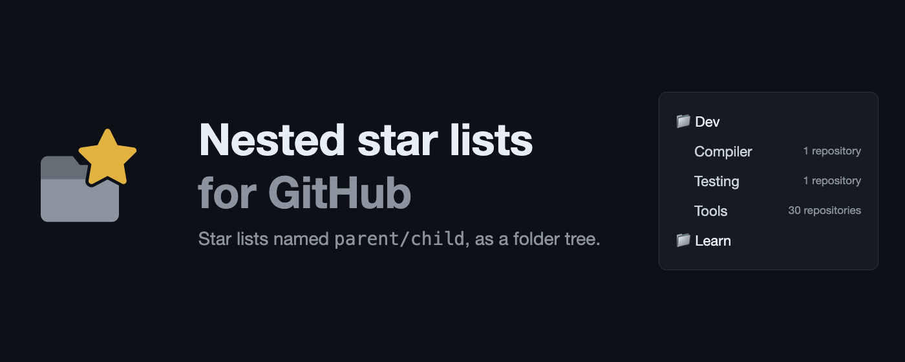
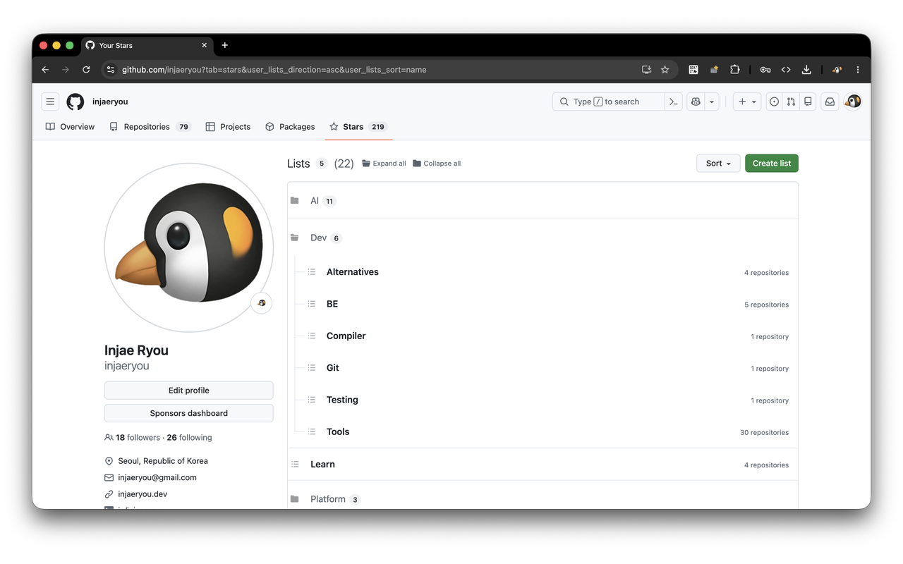
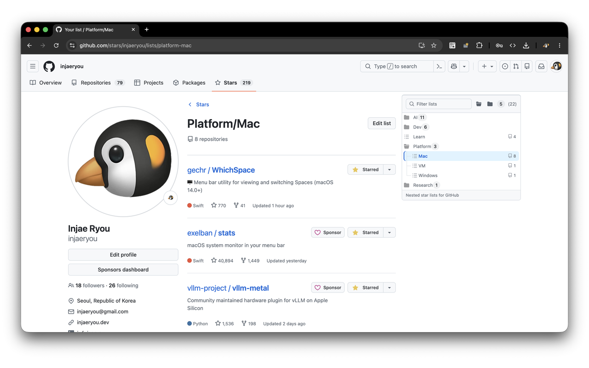

# Nested star lists for GitHub

[](https://chromewebstore.google.com/detail/nested-star-lists-for-git/knkohgnfichgohgpnfjcehmphemiopao)
[](https://addons.mozilla.org/en-US/firefox/addon/nested-star-lists-for-github/)
[](https://microsoftedge.microsoft.com/addons/detail/nested-star-lists-for-git/hnhkbaomfpbmimpljamampajglpakknp)

GitHub star lists are one level deep. This browser extension (Chrome, Firefox
and Edge, Manifest V3) reads a naming convention — `parent/child` — and draws
your star lists as a collapsible folder tree: on the profile's stars tab, and as
a pinned rail of every list beside a single list's page. The star button's "Add
to list" panel gets the same tree, folded in place.

Nothing is stored anywhere and no list is modified: your lists keep their real
names, and the tree is built in the page from them.

> [!NOTE]
> No API token: your lists are read through the GitHub session you are already
> signed into — private lists included, nothing stored, nothing to leak.



## Naming

Name a list `parent/child` and it nests — any depth, and only a slash nests:

```
parent                    →  parent
parent/child              →  └ child
parent/child/grandchild   →     └ grandchild
```

A list named exactly like a folder (`parent` next to `parent/child`) becomes
that folder's own clickable row.

On a single list's page the same tree comes along as a rail, with a filter:



## Install

- [Chrome Extensions](https://chromewebstore.google.com/detail/nested-star-lists-for-git/knkohgnfichgohgpnfjcehmphemiopao)
- [Firefox Add-ons](https://addons.mozilla.org/en-US/firefox/addon/nested-star-lists-for-github/)
- [Edge Add-ons](https://microsoftedge.microsoft.com/addons/detail/nested-star-lists-for-git/hnhkbaomfpbmimpljamampajglpakknp)

## Develop

Load it unpacked from a clone:

- **Chrome** — `chrome://extensions` → *Developer mode* → *Load unpacked* →
  pick this folder.
- **Firefox** — `about:debugging#/runtime/this-firefox` → *Load Temporary
  Add-on* → pick `manifest.json`.
- **Edge** — `edge://extensions` → *Developer mode* → *Load unpacked* → pick
  this folder.

Then open your stars: `github.com/<you>?tab=stars`. Settings — sort order,
folders expanded by default, full list names — live behind the toolbar icon.

## Licence

[Apache-2.0](LICENSE).
